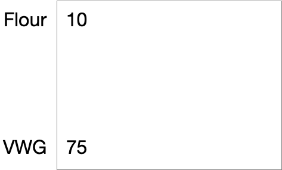
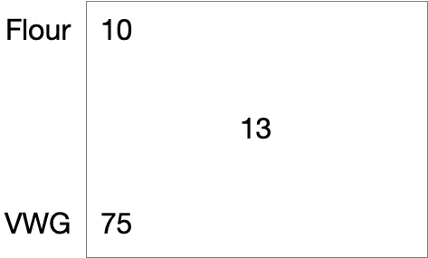
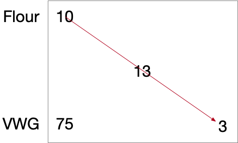
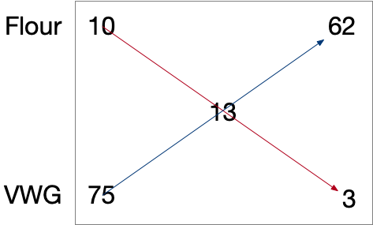

# Pearson Square and Sourdough
// Metadata
:title: Pearson Square and Sourdough
:description: Using the Pearson Square to make strong flour
:keywords: Math, Pearson Square, Sourdough, strong flour
:source-highlighter: pygments
:pygments-style: manni
:pygments-linenums-mode: inline
:icons: font
:stem:
:tip-caption: 💡

It's a pandemic.  You decide to make sourdough.  You're too cheap to buy strong flour. You're more Walmart bulk all-purpose flour.  But you read that protein and gluten are important!

That Walmart bulk all-purpose flour is 10g /100g, or 10%, protein.  Strong bread flour is about 13% and very strong is about 14%.

What to do? Well, add some protein?  How?  Add vital wheat gluten to your cheap all-purpose flour.   Vital wheat gluten is about 75% protein.

So now I've got 10% flour and 75% vital wheat gluten and I want 13% flour. (Yes, I'm being lazy. I mean 10% protein content. )

This math seems hard.  ENTER THE PEARSON SQUARE! This simple calculation is used by farmers mixing feed.  Who knew?  People in agriculture, I'm guessing.

Let's see how this works.

Draw a box and add the percentages for each ingredient

Put the desired percent of protein in the middle of the box.

Going catty-corner, subtract that larger number from the smaller number.

 The result is 62 parts Flour and 3 parts VWG.  Let's convert that to percentages.
 62/65 = .95 or 95% Flour
 3/65 = 0.05 or 5% VWG
[%header, cols=6]
|===
|Ingredient
| %
|
|Parts
|
|

| Flour
|stem:[10]
|
|stem:[75 - 13 = 62]
|stem:[62 / 65 * 100]
|stem:[95.38%]

|desired
|
|stem:[13]
|
|
|

|VWG
|stem:[75]
|
|stem:[13 -10 = 3]
|stem:[3/65 * 100]
|stem:[4.61%]

|total parts
|
|
|stem:[62 + 3 = 65]
|
|
|===
For 700g of total weight you would use stem:[700g * 95.38% = 667.66g] of cheap all-purpose flour, and stem:[700g * 4.61% = 32.27g] of vital wheat gluten to get that 13% protein flour teeming with stretchy gluten.

## Is this right?

    35g VWG at 75% protein is 24.2g of protein.
    665g of flour at 10% protein as 66.8g of protein.
    That's 91g of protein altogether.
    13% of 700g is 91g of protein.

## Is this magic?  It looks like magic.
Yes.  The spell for removing evil will be covered in another article.

Just kidding.  It's not magic.  It's math!

OK .  Let's break this down. First, we'll define some things.

***
stem:[P_f] is the parts protein of the flour +
stem:[P_v] is the parts protein  of the vital wheat gluten +
stem:[P] is the desired percent of protein.
***

We know that some value, stem:[x], times stem:[P_f] + some value, stem:[y], times stem:[P_v] is the desired percentage of protein.  Since it's a percentage, we also now that 100 minus all this is also true.

****
stem:[P =  P_fx + P_vy] +
stem:[(100 - P) = (100 - P_f)x + (100 - P_v)y] +
 +
I stem:[13 = 10x + 75y] +
II stem:[87 = 90x + 25y]
****

Let's get rid of y.

****
I stem:[13 = 10x + 75y] +
I stem:[(13)(25) = (25)(10x + 75y)] +
I stem:[325 = 250x + 1875y] +
 +
II stem:[(87)(75) = 75(90x + 25y)] +
II stem:[6525 = 6750x  + 1875y] +
 +
I stem:[1875y = -250x + 325] +
II stem:[6525 = 6750x -250x + 325] +
II stem:[6200 = 6500x] +
II stem:[6200 = 6500x] +
II stem:[x = 62/65]
****

Sweet, now let's solve for y.

****
I stem:[75y = -10(62/65) + 13] +
I stem:[75y = -10(62/65) + 845/65] +
I stem:[75y = 225/65] +
I stem:[y = 3/65] +
 +
stem:[x = .9538 = 95.38%] +
stem:[y = .0461 = 4.61%] +
****
From the Pearson Square,
****
stem:[x = (P_v - P)/(P_v- P_f)] +
stem:[y = (P - P_f)/(P_v- P_f)]
****
So,
****
stem:[P =  P_f\frac{(P_v - P)}{(P_v- P_f)} + P_v\frac{(P - P_f)}{(P_v- P_f)}] +
stem:[P(P_v- P_f) =  P_f(P_v - P) + P_v(P - P_f)] +
stem:[PP_v - PP_f =  P_fP_v - PP_f + PP_v - P_fP_v] +
stem:[PP_v - PP_f =  - PP_f + PP_v] +
stem:[PP_v  =  PP_v]
****
TADA!

